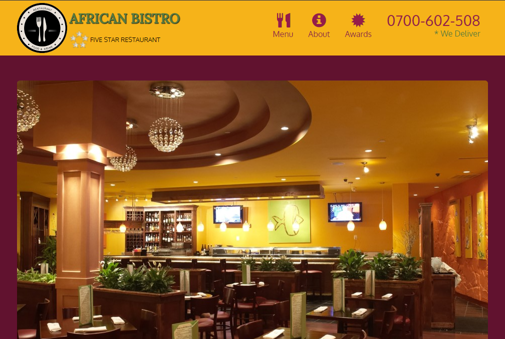
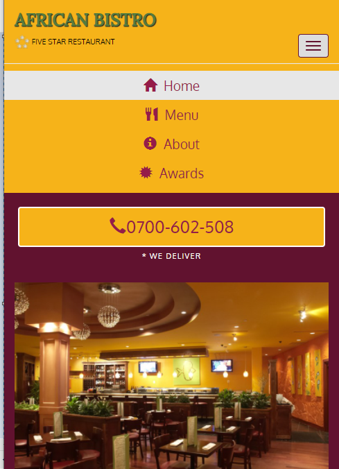

# AngularJS Web Application
 
## Description

This website exemplifies industry-leading responsive design - scaling seamlessly across all modern devices, delivering content flawlessly on diverse screen sizes, with an elegant and intuitive user interface.

Powered by AngularJS, this website is a perfect balance of form and function that is designed to enhance the user experience. It boasts a sleek design, effortless navigation, lightning-fast performance, 
and is highly responsive across all devices.

### This is the homepage on a wide screen.

### This is the view on a smaller screen such as a tablet or smartphone.

## Installation

To run this web application, ensure that you have npm, Node and Angular installed locally.

Navigate into the project directory. Once there, enter the following command in the Angular CLI:

        ng serve --open

This command will build and serve the application then open the URL in your default browser.

## Technology Used

- AngularJS
- CSS
- Bootstrap
- HTML5

